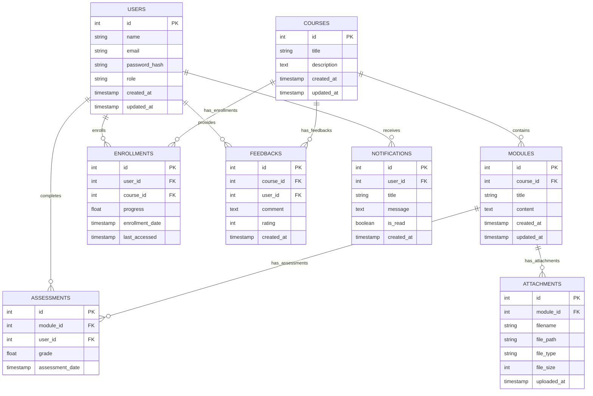

# ER-диаграмма учебной платформы

## Описание сущностей

### Users (Пользователи)
- **id** - уникальный идентификатор пользователя
- **name** - имя пользователя
- **email** - электронная почта (уникальная)
- **password_hash** - хэш пароля
- **role** - роль пользователя (student, teacher, admin)
- **created_at** - дата и время создания
- **updated_at** - дата и время обновления

### Courses (Курсы)
- **id** - уникальный идентификатор курса
- **title** - название курса
- **description** - описание курса
- **created_at** - дата и время создания
- **updated_at** - дата и время обновления

### Modules (Модули курса)
- **id** - уникальный идентификатор модуля
- **course_id** - идентификатор курса (внешний ключ)
- **title** - название модуля
- **content** - содержимое модуля
- **created_at** - дата и время создания
- **updated_at** - дата и время обновления

### Enrollments (Регистрации на курсы)
- **id** - уникальный идентификатор регистрации
- **user_id** - идентификатор пользователя (внешний ключ)
- **course_id** - идентификатор курса (внешний ключ)
- **progress** - прогресс прохождения курса (в процентах)
- **enrollment_date** - дата регистрации
- **last_accessed** - дата последнего доступа

### Assessments (Оценки)
- **id** - уникальный идентификатор оценки
- **module_id** - идентификатор модуля (внешний ключ)
- **user_id** - идентификатор пользователя (внешний ключ)
- **grade** - оценка
- **assessment_date** - дата выставления оценки

### Feedbacks (Отзывы)
- **id** - уникальный идентификатор отзыва
- **course_id** - идентификатор курса (внешний ключ)
- **user_id** - идентификатор пользователя (внешний ключ)
- **comment** - текст отзыва
- **rating** - рейтинг (от 1 до 5)
- **created_at** - дата и время создания

### Attachments (Вложения)
- **id** - уникальный идентификатор вложения
- **module_id** - идентификатор модуля (внешний ключ)
- **filename** - имя файла
- **file_path** - путь к файлу
- **file_type** - тип файла
- **file_size** - размер файла
- **uploaded_at** - дата и время загрузки

### Notifications (Уведомления)
- **id** - уникальный идентификатор уведомления
- **user_id** - идентификатор пользователя (внешний ключ)
- **title** - заголовок уведомления
- **message** - текст уведомления
- **is_read** - статус прочтения
- **created_at** - дата и время создания
